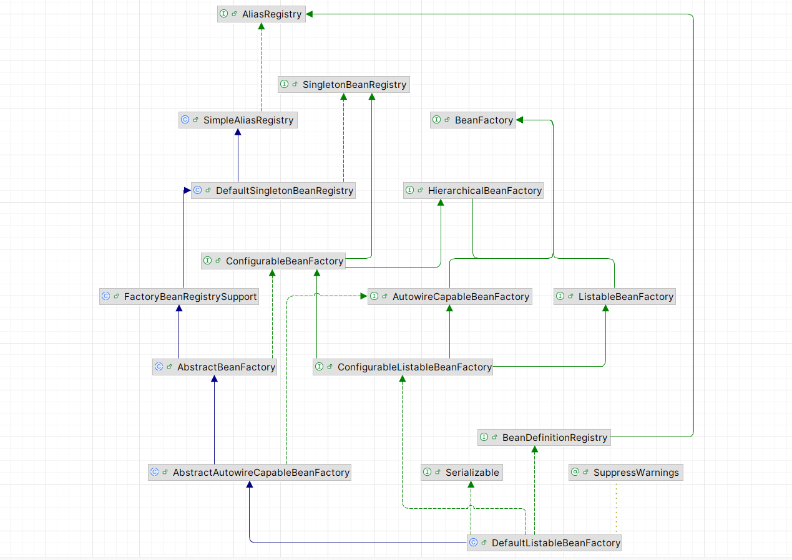
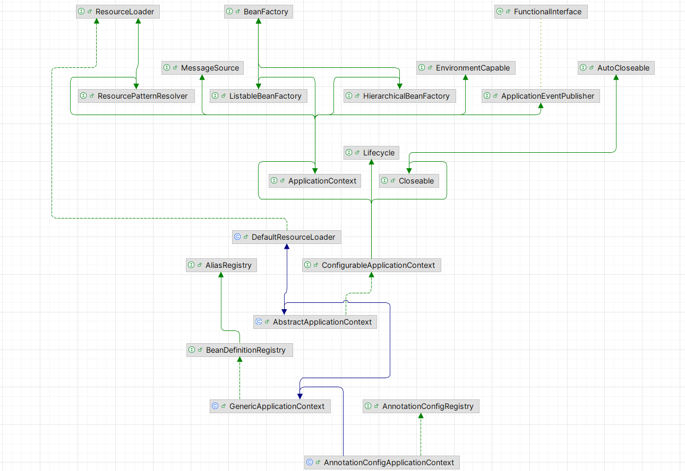
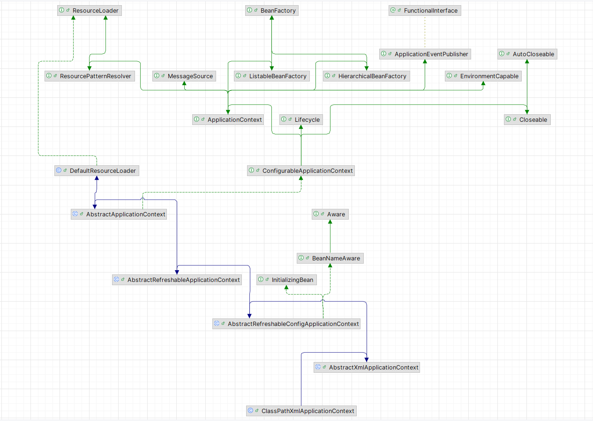
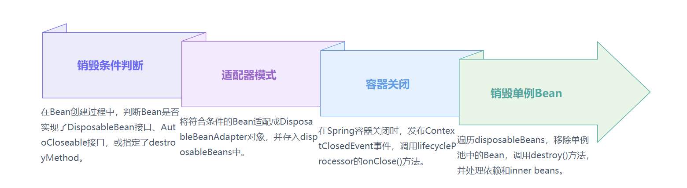

## 核心类实现结构

DefaultListableBeanFactory 是非常强大的，支持很多功能，可以通过查看类实现结构

### DefaultListableBeanFactory 的类继承实现结构

### AnnotationConfigApplicationContext 类继承实现结构

1. ConfigurableApplicationContext：继承了ApplicationContext接口，增加了，添加事件监听器、添加 BeanFactoryPostProcessor、设置 Environment，获取 ConfigurableListableBeanFactory 等功能； 
2. AbstractApplicationContext：实现了 ConfigurableApplicationContext 接口；
3. GenericApplicationContext：继承了 AbstractApplicationContext，实现了 BeanDefinitionRegistry 接口，拥有了所有 ApplicationContext 的功能，并且可以注册 BeanDefinition，注意这个类中有一个属性 (DefaultListableBeanFactory beanFactory)； 
4. AnnotationConfigRegistry：可以单独注册某个为类为 BeanDefinition（可以处理该类上的 **@Configuration** 注解，已经可以处理 **@Bean 注解**），同时可以扫描； 
5. AnnotationConfigApplicationContext：继承了 GenericApplicationContext，实现了 AnnotationConfigRegistry 接口，拥有了以上所有的功能；

### ClassPathXmlApplicationContext 类继承实现结构
它也是继承了 AbstractApplicationContext，但是相对于AnnotationConfigApplicationContext 而言，功能没有 AnnotationConfigApplicationContext 强大，比如不能注册 BeanDefinition。

## Bean 的生命周期

1. InstantiationAwareBeanPostProcessor.postProcessBeforeInstantiation()
2. 实例化 
3. MergedBeanDefinitionPostProcessor.postProcessMergedBeanDefinition()
4. InstantiationAwareBeanPostProcessor.postProcessAfterInstantiation()
5. 自动注入 
6. InstantiationAwareBeanPostProcessor.postProcessProperties()
7. Aware对象 
8. BeanPostProcessor.postProcessBeforeInitialization()
9. 初始化 
10. BeanPostProcessor.postProcessAfterInitialization()

[Bean的销毁过程](https://share.note.youdao.com/ynoteshare/index.html?id=1f3f25f6dc56c043ce8cc9dca586f2db&type=note&_time=1756628252359)

